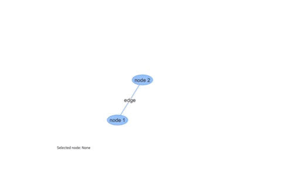

# streamlit-vis-network

Streamlit component that allows you to visualize networks using vis.js

## Installation instructions

```sh
pip install streamlit-vis-network
```

## Usage instructions

```python
import streamlit as st
from streamlit_vis_network import streamlit_vis_network

# define nodes and edges as python dicts
nodes = [{'id': 1, "label": "node 1"}, {'id': 2, "label": "node 2"}]
edges = [{"from": 1, "to": 2, "label": "edge", "id": "edge1"}]

# pass nodes and edges to component constructor
selection = streamlit_vis_network(nodes, edges, height=500, width=500)

# display selected node/edge
if selection:
    selected_nodes, selected_edges, positions = selection
    if selected_nodes:
        st.write(f"Selected node: {selected_nodes[0]}")
    elif selected_edges:
        st.write(f"Selected edge: {selected_edges[0]}")
    else:
        st.write("No current selection.")
else:
    st.write("No current selection.")

# show node positions
if st.toggle(label="Show Node Positions") and selection:
    st.write("Node Positions")
    st.write(positions)
```

## Demo

