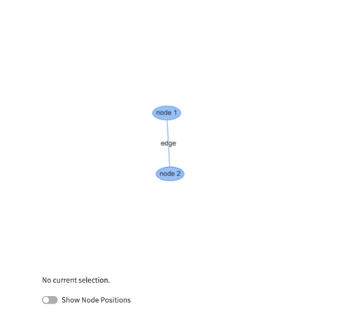

# streamlit-vis-network

Streamlit component that allows you to visualize networks using vis.js

## Installation instructions

```sh
pip install streamlit-vis-network
```

## Usage instructions

```python
import streamlit as st

from streamlit_vis_network import streamlit_vis_network

nodes = [{"id": 1, "label": "node 1"}, {"id": 2, "label": "node 2"}]
edges = [{"from": 1, "to": 2, "label": "edge"}]

# display network visualization
value = streamlit_vis_network(nodes=nodes, edges=edges)

# display selected node
st.write(value)
```

## Demo

